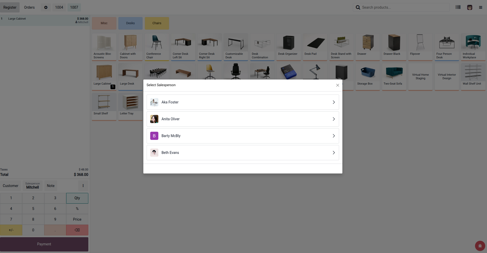

# POS Line Salesperson

Assign a salesperson on each POS order line, control allowed salespersons per shop, and analyze sales by salesperson in POS reporting.

## Key Features

- Add **Salesperson** on every POS order line.
- Show salesperson on the order line in POS UI.
- Configure allowed salespersons per POS shop (`Point of Sale > Configuration > Point of Sale`).
- Show employee avatars in salesperson selection popup.
- Keep salesperson information on backend order lines.
- Extend **Orders Analysis** with salesperson filter/grouping support.

## Functional Flow

1. Go to POS configuration and select employees in **Line Salespersons**.
2. Open POS session for that shop.
3. Select an order line and click **Salesperson** button.
4. Pick an employee from the popup.
5. Salesperson is saved per line and available in reports.

## Screenshot

## Technical Notes

- Module depends on:
  - `point_of_sale`
  - `hr`
- Odoo version: `19.0`
- License: `LGPL-3`

## Support

- Maintainer: **Hameed Pvt.Ltd**
- Email: **nadeemwazir0123@gmail.com**

## Author

by **Muhammad Nadeem (nk)**
