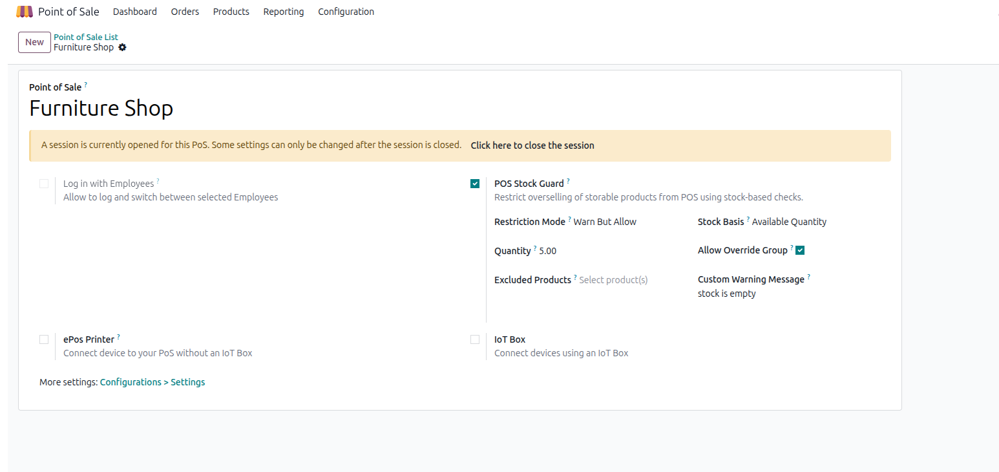

# POS Stock Restriction and Overselling Control

## Overview

POS Stock Restriction and Overselling Control prevents overselling in Odoo 19 Point of Sale by validating stock before adding quantity.
It supports strict blocking and warning confirmation modes, per POS configuration.

## Key Features

- Block or warn when requested quantity exceeds stock
- Two stock bases:
  - Available Quantity (`free_qty`)
  - Forecast Quantity (`virtual_available`)
- Reserve buffer quantity to keep safety stock
- Exclude selected products from stock guard checks
- Optional override behavior with dedicated user group
- Detailed event logs for warnings and blocked attempts
- Checks both flows:
  - Add product to order
  - Increase quantity from numpad

## Behavior

### Block Sale

When requested total quantity exceeds allowed quantity:
- Show blocking popup with stock details
- Stop action immediately

### Warn But Allow

When requested total quantity exceeds allowed quantity:
- Show confirmation dialog with stock details
- Ask: "Do you want to continue anyway?"
- If `Cancel`: stop action
- If `Continue`: proceed

## Installation

1. Copy module into addons path.
2. Update apps list.
3. Install `POS Stock Restriction and Overselling Control`.

## Configuration

1. Go to **Point of Sale > Configuration > Point of Sale**.
2. Open POS shop config.
3. Enable **POS Stock Guard**.
4. Set:
   - **Restriction Mode** (`Block Sale` or `Warn But Allow`)
   - **Stock Basis** (`Available Quantity` or `Forecast Quantity`)
   - **Reserve Quantity** (optional)
   - **Allow Override Group** (optional)
   - **Excluded Products** (optional)
   - **Custom Warning Message** (optional)
5. Save configuration.
6. Close current session (if open) and start a new session.

### Configuration Preview

## Override Group

Group name:
- **POS Stock Guard Override**

Usage:
- Assign this group to users from **Settings > Users**.
- Effective only when **Allow Override Group** is enabled in POS config.

## Logs

Open:
- **Point of Sale > Configuration > Stock Guard Logs**

Log includes:
- User, POS, session, product
- Action (`warn` / `block`)
- Basis and quantities (available, reserve, requested, allowed)
- Detail message

## Technical Notes

- Odoo version: 19.0
- Dependencies: `point_of_sale`, `stock`
- License: LGPL-3
- Technical name: `pos_stock_guard_plus`

## Author

- Author: Muhammad Nadeem (nk)
- Maintainer: Hameed Pvt.Ltd
- Support: nadeemwazir0123@gmail.com

## Version

- 19.0.1.0.0
